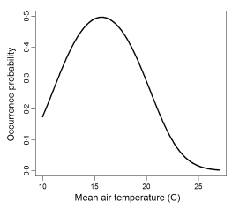

<style>
strong {
  font-weight: bold;
}
</style>


## Why model selection?

<br>

> * _Nested models_: how much complexity is necessary to fit the data?

> * _Non-nested models_: compare fit of different models (e.g. alternative hypotheses)

>   * Note that building a larger model may be better than choosing any one of them!

> * Important facts:

>   * Larger models usually fit data better

>   * Models usually perform much worse with independent data than with observed (calibration) data

>   * Need to account for model complexity (overfitting)


--- &twocol

## Overfitting and balanced model complexity


```{r options, echo=FALSE}
opts_chunk$set(comment=NA, fig.width=4, fig.height=4, fig.align='center', size='small', cache=FALSE)
```


*** =left

```{r simuldata, echo=FALSE}
x <- seq(1:10)
y <- rnorm(10, 2 + 0.2*x, 0.3)
```


```{r linreg, echo=FALSE}
m1 <- lm(y~x)
plot(x,y, las=1, pch=19, main="Simple linear regression")
abline(m1, lwd=2, col="red")
```

```{r overfitted, echo=FALSE, warning=FALSE, message=FALSE, fig.cap="Overfitted model"}
require(gam)
require(visreg)
m2 <- gam(y~s(x, df=10))
visreg(m2, line.par=list(col="red", lwd=2))
points(x,y, pch=19)
title("Overfit model")
```


*** =right

```{r wrongmodel, echo=FALSE, fig.cap="Wrong model"}
y2 <- rnorm(10, 2 + 0.8*x - 0.08*x^2, 0.3)
m3 <- lm(y2~x)
plot(x, y2, las=1, pch=19, main="Underfit/wrong model")
abline(m3, col="red", lwd=2)
```


--- &twocol

## Overfitting: an example with niche modelling


<br>

Wenger & Olden (2012) [Assessing transferability of ecological models: an underappreciated aspect of statistical validation](http://dx.doi.org/10.1111/j.2041-210X.2011.00170.x). _Methods Ecol Evol_. 

<br>

*** =left

GLMM 



*** =right

Random forests (overfit) 


---

## So, two important aspects of model selection

<br>

> * On one hand, we want to maximise fit.

> * On the other hand, we want to avoid overfitting and overly complex models.


---

## Evaluating models' predictive accuracy


* Cross-validation (k fold, leave one out...)

> * Alternatives:
    * AIC
    * BIC
    * DIC
    * WAIC

> * All these attempt an impossible task: 
      * estimating out-of-sample prediction error without external data or further model fits!

> * All these methods have flaws!


---

## Cross-validation

<br>

Preferred method, but

>  * Requires splitting data (difficult for structured data: space, time)
>  * Data may not be independent (e.g. due to spatial or temporal autocorrelation)
>  * Computationally expensive (requires fitting many models)


---

## AIC


> * First term: model fit (deviance, log likelihood)

> * k: number of estimated parameters (penalisation for model complexity)

> * AIC biased towards complex models.

> * AICc recommended with 'small' sample sizes (n/p < 40). But see [Richards 2005 Ecology](http://www.esajournals.org/doi/pdf/10.1890/05-0074).

> * Doesn't work with hierarchical models or informative priors!


---

## DIC


<br>


> * First term: posterior deviance (Bayesian)
> *  effective number of parameters 
    * (influenced by priors and the amount of pooling in hierarchical models)


---

## What about BIC?

<br>


> * Larger penalty with large datasets (favouring simpler models)

> * Not intended for assessing out-of-sample model performance

> * Problematic (e.g. Burnham et al. 2011, or Gelman et al. 2013 do not recommend it; but see Link & Barker 2006).


---

## Problems of IC

> * No information criteria is panacea: all have problems (see refs at the end).

> * They give average out-of-sample prediction error, but prediction errors can differ substantially within the same dataset (e.g. populations, species).

> * Sometimes better models rank poorly (Gelman et al. 2013). So, combine with thorough model checks.

---

## So which variables should enter my model?

> * Choose variables based on **ecological understanding**, rather than throwing plenty of them in a fishing expedition.

> * Propose single global model or small set (< 10 - 20) of **reasonable** candidate models.

> * Number of variables balanced with sample size (at least 10 - 30 obs per param)

> * Assess collinearity between predictors (Dormann et al 2013)
>    * pairs() or similar
>    * If |r| > 0.5 - 0.7, consider leaving one variable out, but keep it in mind when interpreting model results.
>    * Or combine 2 or more in a synthetic variable (e.g. water deficit ~ Temp + Precip).
>    * Many methods available, e.g. sequential, ridge regression... (see Dormann et al)
>    * Measurement error can seriously complicate things (Biggs et al 2009; Freckleton 2011)
    
> * For predictors with large effects, consider interactions.
    
> * See also Zuur et al 2010.


--- &twocol

## Think about the shape of relationships

y ~ x + z

Really? Not everything has to be linear! Actually, it often is not.

**Think** about shape of relationship. See chapter 3 in Bolker's book.


*** =left

```{r echo=FALSE}
curve(0.7 + 0.3*x, ylab="y", las=1)
```


*** =right

```{r echo=FALSE}
curve(0.7*x^0.3, ylab="y", las=1)
```


--- 

## Sample size is important

http://vimeo.com/57127001

> Especially if you want to include interactions!


--- 

## Removing predictors

---

## Do not use stepwise regression

> * Whittingham et al. (2006) Why do we still use stepwise modelling in ecology and behaviour? J. Animal Ecology.

> * Mundry & Nunn (2009) Stepwise Model Fitting and Statistical Inference: Turning Noise into Signal Pollution. Am Nat.

> * This includes stepAIC (e.g. Dahlgren 2010; Burnham et al 2011; Hegyi & Garamszegi 2011).

---

## Gelman's criteria for removing predictors

(assuming only potentially relevant predictors have been selected a priori)


> * NOT significant + expected sign = let it be.

> * NOT significant + NOT expected sign = remove it.

> * Significant + NOT expected sign = check… confounding variables?

> * Significant + expected sign = keep it!


--- 

## How to make your results significant

> 1. Test multiple variables, then report the ones that are significant.

> 2. Artificially choose when to end your experiment.

> 3. Add covariates until effects are significant.

> 4. Test different conditions (e.g. different levels of a factor) and report the ones you like.

> 5. Read [Simmons et al 2011](http://papers.ssrn.com/sol3/papers.cfm?abstract_id=1850704)

> 6. Let's substitute 'statistical significance' by something [more informative and less misleading](http://www.significancemagazine.org/details/webexclusive/5397521/The-statistics-dictionary-Significantly-misleading.html)

---

## Statistical Errors: type I-II versus M-S

> * Type I: incorrect rejection of null hypothesis.

> * Type II: failure to reject false null hypothesis.

> * In ecology, everything is different. Finding a significant difference will mostly depend on your sample size (and researchers' degrees of freedom; Simmons et al 2011).

> * Type S (Sign): estimating effect in opposite direction.

> * Type M (Magnitude): Misestimating magnitude of the effect (under or overestimating).

> * Avoid also Type III error (Dangles & Casas 2012): finding right answer to the wrong question!


---

## Plot everything

These 4 datasets give identical linear regressions. But differences are obvious. So models' summary statistics are not enough: [plot everything!](http://blog.plot.ly/post/68951620673/why-graph-anscombes-quartet)

```{r anscombe, include=FALSE}
example(anscombe)
```


---

## Summary

> 1. Choose meaningful variables
  + Beware collinearity
  + Keep good n/p ratio

> 2. Generate global model or (small) set of candidate models
  + Avoid stepwise and all-subsets
  + Don't assume linear effects: think about appropriate functional relationships
  + Consider interactions for strong main effects
  
> 3. If > 1 model have similar support, consider model averaging.

> 4. Always check thoroughly fitted models
  + Residuals, goodness of fit...
  + Plot. Check models. Plot. Check assumptions. Plot. (Lavine 2014).
  
> 5. Move away of statistical significance -> effect sizes, type M and S errors...


---

## To read more

* Olden & Jackson (2000) Torturing data for the sake of generality: How valid are our regression models? Ecoscience.

* Burnham & Anderson book (2002). Anderson 2008 book.

* Johnson & Omland (2004) Model selection in ecology and evolution. TREE

* Anderson & Burnham (2002) Avoiding pitfalls when using information-theoretic methods. J. Wildlife Management.

* Richards (2005) Testing ecological theory using the information-theoretic approach: Examples and cautionary results. Ecology.

* Link & Barker (2006) MODEL WEIGHTS AND THE FOUNDATIONS OF MULTIMODEL INFERENCE. Ecology.

* Murray & Conner (2009) Methods to quantify variable importance: implications for the analysis of noisy ecological data. Ecology.

---

## To read more

* Murtaugh (2009) Performance of several variable-selection methods applied to real ecological data. Ecology Letters.

* Dahlgren (2010) Alternative regression methods are not considered in Murtaugh (2009) or by ecologists in general. Ecology Letters.

* Model selection, multimodel inference and information-theoretic approaches in behavioural ecology. [Special Issue of Behav Ecol & Sociobiol](http://link.springer.com/journal/265/65/1/page/1).

* Grueber et al (2011) Multimodel inference in ecology and evolution: challenges and solutions. J. Evol Biol.

* Gelman et al (2013) Understanding predictive information criteria for Bayesian models. 


---

## END

<br>

Hope it was useful!


